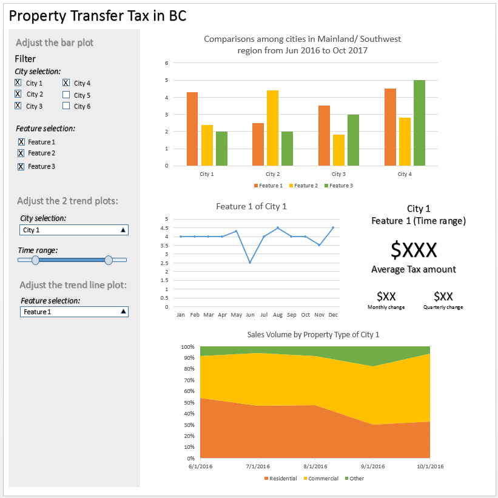

## British Columbia Property Transfer Tax Project

Duong Vu

January 14th, 2018

[British Columbia Property Transfer Tax Shiny App](https://duongvu39.shinyapps.io/BCproptax/)

## Overview

There are more and more people coming to British Columbia with the intention to buy a real estate property. This is a big decision involving a lot of money. To have an overview of the market in Mainland/ Southwest, I propose to build a Shiny app to visually explore the dataset of British Columbia property transfer tax.

This App will help not only buyers and investors but also regulators to have some general idea of the real estate market in Mainland/ Southwest. My app will show information about the property transfer tax over the years 2016 and 2017 for different cities in this region.

## Description of the data

My dataset is published in Data BC website by British Columbia government. I will use the municipal monthly dataset obtained from the 2016 and 2017 market transactions in the whole region. There are 17 months in total from June 2016 to Oct 2017. The data includes 22 variables for 16 cities. Each variable contains some statistics about the property transfer tax. All variables are numeric and can be either count or dollar amount (the total number of market transactions, FMV sums - the sum of purchases declared fair market value, etc.). For some money variables, the dataset also provides information about sum, mean and mode.

## Usage scenario & tasks

The BC government recently implemented a new law in August 2016:  Additional Property Transfer Tax to add 15% tax on foreign entities. This new regulation affects the property transfer market in BC, especially the Mainland/ Southwest region. Policymakers would want to know which city is affected the most and to what extent does the effect take place. The policymakers of the government can use my "BC Property Tax Transfer" app to have some overview of the situation and how the implementation of this new tax affects the trend in transferring real estate in Mainland/ Southwest region. First, they can take a look at the bar plot and choose several cities as well as the information of interest to determine which city has more activity in the property tax transfer market. He/she may be interested in several cities and when plotting the bar plot, he/she notices that City of Vancouver, Burnaby, and Victoria seems to have a lot of activity in the property transfer marker. Then he/ she can select one city to see its trend over time (before and after the implementation of the law: August 2016). Here he/she would find that the total value of transfer on the month before the implementation of the law increases and in the month of implementation, the sale value drops dramatically. To have a better idea of which property market fluctuate the most, the policymaker can look at the stacked plot and find the proportion change over 17 months. Because the government wants to attract more investment (commercial property) without increasing the residential property price in order to keep the housing market stable. Based on the app, the officer sees some initial effects of the new tax law and can decide whether or not to investigate more on this topic and in which city/ sector.

## Description of app & initial sketch

There are three plots and one text visualization in my app. The first one is a bar plot showing the differences among cities with several dataset factors (total amount of transaction of residential, commercial, etc.). Each factor will have a unique color. The next two trending plots show the changes over the years 2016 and 2017. Users can choose one city from the drop-down list on the right with the time range (range slider) for these two trending plots. The trend line plot shows the change of selected city and feature within the selected time range. The text adjacent to the progression plot shows some calculated data based on the selection of city and feature. The stacked plot at the end presents the volumes change within the selected city's real estate market among three types of property: residential, commercial and others. 

*I use Power Point to sketch my draft graph.*

